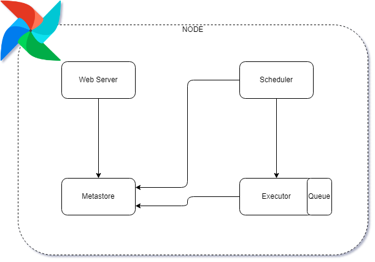
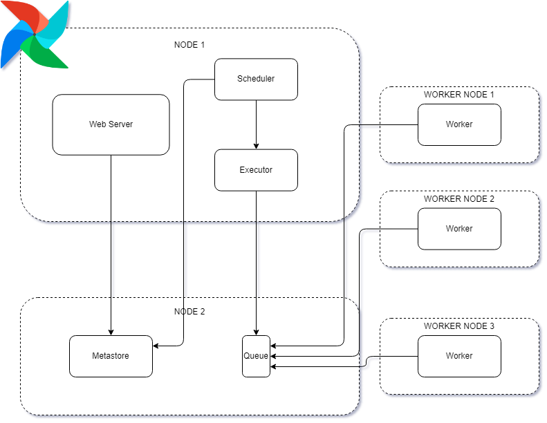

# Essentials

## O que é Airflow?

Apache Airflow é uma plataforma open source onde é possível criar, monitorar e gerenciar pipelines de forma programática. Ou seja, é um orquestrador que tem a possibilidade de criar piplines dinâmicos, executar tarefas, na ordem correta e também no momento certo. Airflow não é um framework de streaming ou de processamento de dados. Airflow <> Spark.

Airflow é programado em Python, é escalável e possui interatividade (user interface, CLI [command-line interface], REST api ).

## Core Components

- Web Server - é a user interface;
- Scheduler - responsável por agendar e iniciar tarefas;
- Metada Database - coleção de dados relacionados à usuários, ttarefasask, variáveis e conexões;
  - Qualquer database que for compatível com SQLAlchemy pode ser usado com Airflow (Postsgres, MySQL, Oracle, SQLite, até MongoDB)

Componentes adicionais:

- Executor - componente que define como as tarefas serão executadas;
- Worker - processo ou subprocesso onde a tarefa é executada;

## Arquiteturas Comuns:

Single Node:  

- Todos rescursos estão disponíveis na máquina local, portanto não é escalável;´

1. Web Server puxa as informações da Metastore (status das tarefas, usuários, permissões, etc).
   - Todos os dados visíveis na user interface advêm da Metastore;
2. Se uma tarefa estiver pronta para ser agendada, o Scheduler interage com a Metastore alterando os status, criando uma instância de um objeto tarefa e manda para a fila do Executor.
3. Tarefas agora podem ser puxadas por um Worker para serem executadas.
4. No final da tarefa, o Executo interage com a Metastore alterando o status.

Multi Nodes:

